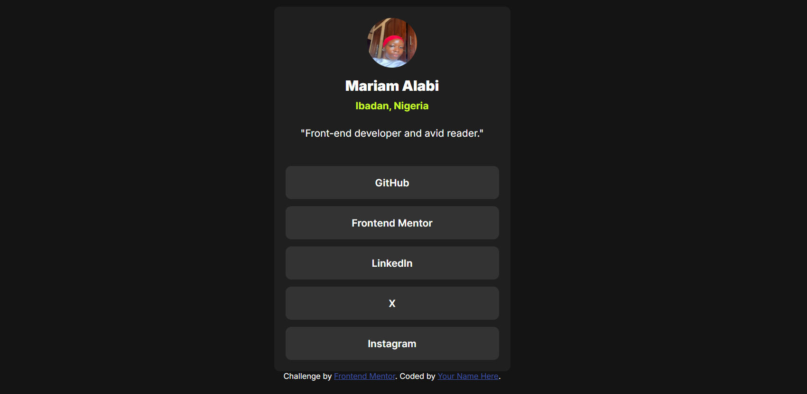
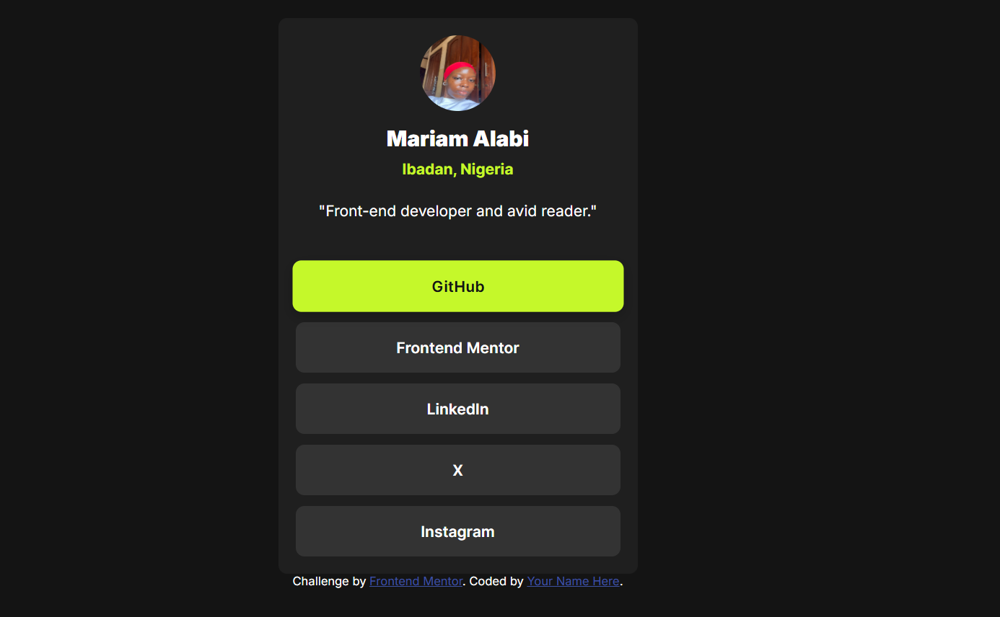

# Frontend Mentor - Social links profile solution

This is my solution to the [Social links profile challenge on Frontend Mentor](https://www.frontendmentor.io/challenges/social-links-profile-UG32l9m6dQ). It's a great beginner-friendly challenge that helped me practice HTML and CSS layout basics, especially styling links like buttons and using Flexbox for layout.

## Table of contents

[Overview](#overview)

  [The challenge](#the-challenge)
  [Screenshot](#screenshot)
  [Links](#links)
  [My process](#my-process)
  [Built with](#built-with)
  [What I learned](#what-i-learned)
  [Continued development](#continued-development)
  [Useful resources](#useful-resources)
  [Author](#author)
  [Acknowledgements](#acknowledgments)


## Overview

### The challenge

Users should be able to:

* See hover and focus states for all interactive elements on the page

### Screenshot




### Links

* Solution URL: [GitHub Repository](https://github.com/morrryyyyy/social-links-profile)
* Live Site URL: [Live on GitHub Pages](https://morrryyyyy.github.io/social-links-profile/)

---

## My process

### Built with

* Semantic HTML5
* CSS custom properties
* Flexbox
* Mobile-first workflow

### What I learned

This project helped me practice:

* Using `flex-direction: column` for vertical layouts
* Styling anchor (`<a>`) tags like buttons
* Managing spacing and alignment inside a centered container
* Adding hover and focus states for better interactivity

```css
.link {
  background-color: var(--grey700);
  color: var(--white);
  padding: 15px;
  border-radius: 8px;
  text-align: center;
  width: 100%;
  box-sizing: border-box;
}

.link:hover{
    background-color: var(--green);
    color: var(--grey900);
    transform: scale(1.02);
    box-shadow: 0 4px 12px rgba(0, 0, 0, 0.2);
}

.link:focus {
    outline: 2px dashed var(--green);
    outline-offset: 4px;
  }
```

### Continued development

I'd like to get more confident with:

* Responsive design tweaks for larger screens
* Accessible markup and focus states
* Using utility classes or a CSS framework for faster styling

### Useful resources

* [CSS Flexbox Guide on MDN](https://developer.mozilla.org/en-US/docs/Web/CSS/flex)
* [Frontend Mentor Discord](https://discord.gg/frontendmentor) – super helpful community!

---

## Author

* Frontend Mentor - [@morrryyyyy](https://www.frontendmentor.io/profile/morrryyyyy)
* Twitter - [@mo\_rrryyyy](https://x.com/mo_rrryyyy)

---

## Acknowledgments
* Thanks to the Frontend Mentor community for providing feedback and resources! 🎉
